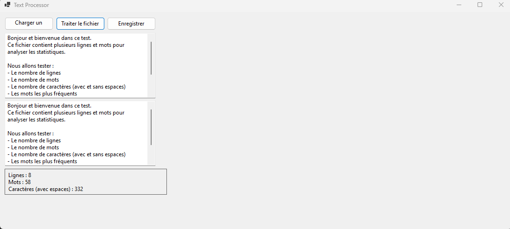

# 📌 Text Processor - Fonctionnalités et Améliorations

# 📝 Description du projet

Text Processor est une application permettant de charger, traiter et analyser du texte à partir de fichiers .txt. L'outil permet d'effectuer des opérations avancées telles que la recherche/remplacement, l'analyse de statistiques, la gestion de plusieurs fichiers et l'exportation des résultats en différents formats.

L'objectif du projet est d'améliorer la manipulation de fichiers texte en offrant une interface intuitive avec des fonctionnalités puissantes adaptées aux besoins de traitement de texte.

commande pour télécharger le projet : 
```sh
git clone https://github.com/ugurkaya67/TextProcessor.git
```

Commande pour lancer l'application : 
```sh
dotnet clean
dotnet build
dotnet run
```

# ✅ Fonctionnalités Implémentées

##  📊 1. Statistiques sur le texte ✅

Nombre de lignes, mots et caractères (avec/sans espaces)

Affichage des mots les plus fréquents

## 🔍 2. Recherche et remplacement de mots ✅

Entrer un mot à chercher et un mot de remplacement

Modifier le texte en temps réel

## 🗂 3. Gestion de plusieurs fichiers TXT ✅

Sélectionner plusieurs fichiers en une seule fois

Appliquer les mêmes transformations à chaque fichier

Sauvegarder les fichiers traités avec un suffixe _modifié.txt

## 🔄 4. Annulation des modifications (Reset) ✅

Réinitialisation du texte original et traité

## 🔥 5. Interface améliorée (UX/UI) ✅

Ajout d’une barre de progression pour les fichiers volumineux

Mode sombre activable/désactivable

Ajustement de l'espacement entre les boutons

## 🎨 6. Personnalisation de l’affichage ✅

Possibilité d'activer/désactiver les statistiques

## 📤 7. Export des statistiques ✅

Export en CSV et JSON

## 🔍 8. Automatisation des tests(à faire) ❌

Ajouter des tests unitaires et d'intégration pour garantir la stabilité du projet

# Visuel de l'interface :
Par défaut : 


Mode Sombre :


# 🛠 Technologies utilisées

Langage : C# (.NET)

Interface graphique : Windows Forms

Formats pris en charge : TXT, CSV, JSON

